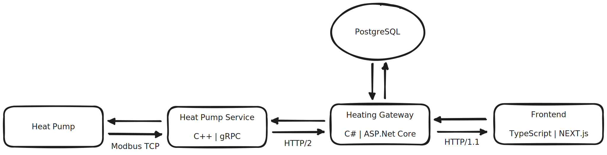

# Terrace Heating

> Full stack application for monitoring and controlling a terrace heating system

#### Motivation

At my parents' home, there is an enclosed terrace for which the heating (underfloor & air) is provided by a *Lämpöässä
Vmi 9* ground source heat-pump. The heating is tied to one of the heat distribution circuits, and there wasn't a clear
and easy way of controlling it. The purpose of this project is to provide a simple UI for monitoring and
controlling the heating of the terrace.

## Features & Architecture

The overall architecture is illustrated with the following image:

- Periodical querying of heat-pump values with [Modbus](https://en.wikipedia.org/wiki/Modbus) TCP connection
  using [libmodbus](https://libmodbus.org/)-library
- A [gRPC](https://grpc.io/) service using [Protocol Buffers](https://developers.google.com/protocol-buffers)
  abstracting away the lower level heat-pump logic
- An [ASP.NET Core](https://en.wikipedia.org/wiki/ASP.NET_Core) Web API acting both as a browser compatible gateway and
  a service for storing queried heat pump records into a database as well as serving them
- The database of choice is [PostgreSQL](https://www.postgresql.org/)
- All components are built and deployed using [Docker Compose](https://docs.docker.com/compose/)
